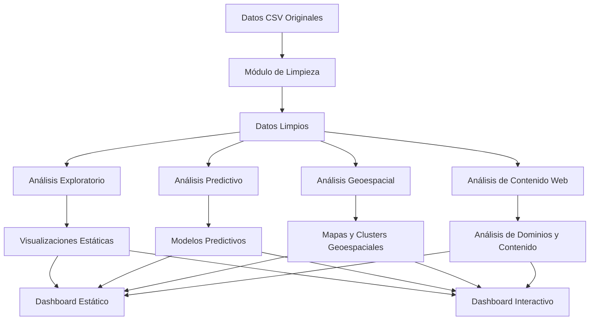
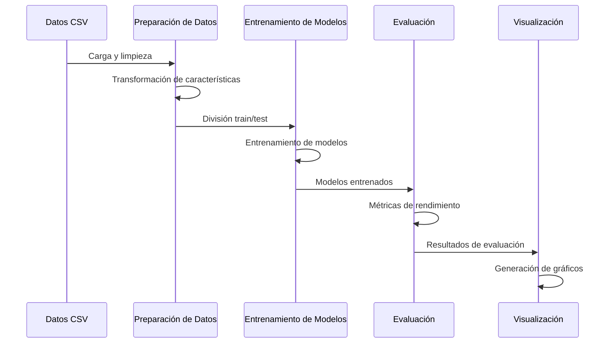
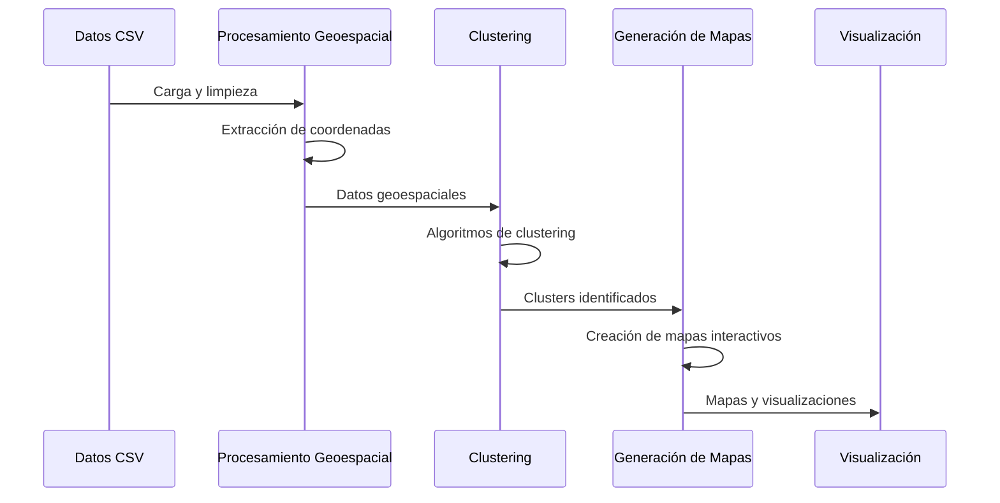

# Diagrama de Flujo de Datos

Este documento presenta el flujo de datos a través de los diferentes módulos del sistema de análisis de datos.

## Visión General del Flujo de Datos

## Descripción de los Componentes

### Entrada de Datos

- **Datos CSV Originales**: Archivo `20250525.export.CSV` con los datos brutos.

### Procesamiento de Datos

- **Módulo de Limpieza**: Implementado en `limpiar_analizar_csv.py`, realiza la limpieza inicial de los datos.
- **Datos Limpios**: Almacenados en `datos_limpios.csv`, representan la versión procesada lista para análisis.

### Módulos de Análisis

- **Análisis Exploratorio**: Estadísticas descriptivas y análisis básico de los datos.
- **Análisis Predictivo**: Modelos de machine learning para predicciones.
- **Análisis Geoespacial**: Análisis basado en coordenadas geográficas.
- **Análisis de Contenido Web**: Análisis de URLs y dominios en los datos.

### Resultados

- **Visualizaciones Estáticas**: Gráficos y figuras generados por los módulos de análisis.
- **Modelos Predictivos**: Modelos entrenados y sus predicciones.
- **Mapas y Clusters Geoespaciales**: Visualizaciones geográficas y agrupaciones.
- **Análisis de Dominios y Contenido**: Resultados del análisis de contenido web.

### Presentación

- **Dashboard Estático**: Informe HTML con visualizaciones estáticas.
- **Dashboard Interactivo**: Aplicación Dash para exploración interactiva de los datos.

## Flujos Específicos

### Flujo de Análisis Predictivo

### Flujo de Análisis Geoespacial

## Integración con el Sistema

El flujo de datos está orquestado por el módulo `ejecutar_analisis.py`, que proporciona una interfaz unificada para ejecutar los diferentes tipos de análisis. Los resultados de todos los análisis se pueden visualizar a través de los dashboards estático e interactivo.

## Consideraciones de Rendimiento

- Los datos limpios se almacenan en disco para evitar reprocesamiento.
- Los modelos predictivos se serializan para su reutilización.
- El dashboard adaptativo proporciona una alternativa ligera cuando no se pueden instalar todas las dependencias.

## Extensibilidad

El diseño modular permite añadir nuevos tipos de análisis o visualizaciones sin modificar el flujo principal de datos. Cada módulo de análisis es independiente y puede ser mejorado o reemplazado según sea necesario.