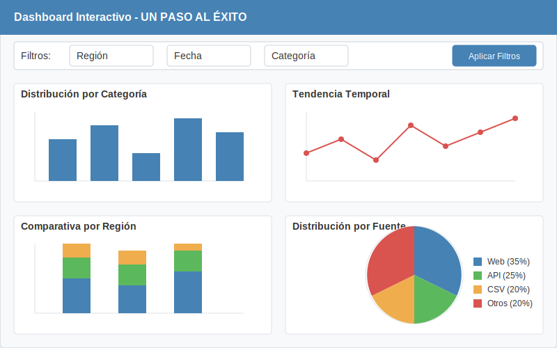
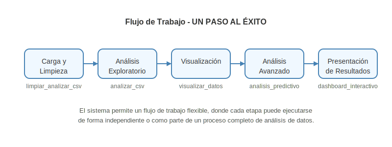

.. Analisis de Datos y Visualizacion documentation master file, created by
   sphinx-quickstart on Tue May 27 14:28:34 2025.
   You can adapt this file completely to your liking, but it should at least
   contain the root `toctree` directive.

Documentación del Proyecto de Análisis de Datos y Visualización
===============================================

Bienvenido a la documentación oficial del proyecto **UN PASO AL ÉXITO**. Esta plataforma integral de análisis de datos proporciona herramientas avanzadas para la limpieza, procesamiento, análisis y visualización de datos, con capacidades especializadas en análisis predictivo, geoespacial y de contenido web.

Visión General
--------------

El proyecto **UN PASO AL ÉXITO** ha sido diseñado como una solución modular y extensible para el análisis de datos, enfocada en proporcionar insights valiosos a través de múltiples dimensiones analíticas. La arquitectura del sistema permite un flujo de trabajo fluido desde la ingesta de datos hasta la presentación de resultados, facilitando tanto análisis exploratorios rápidos como investigaciones profundas.

La plataforma implementa patrones de diseño modernos como Estrategia, Fachada, Observador, Cadena de Responsabilidad y Fábrica, lo que permite una gran flexibilidad y extensibilidad para adaptarse a diferentes casos de uso y conjuntos de datos.

Características Principales
--------------------------

* **Análisis Exploratorio Automatizado**: 
  - Detección inteligente de tipos de datos, valores atípicos y patrones
  - Estadísticas descriptivas automáticas
  - Identificación de correlaciones y dependencias
  - Detección de columnas especiales (geográficas, temporales, URLs)

* **Visualizaciones Interactivas**: 
  - Dashboards dinámicos con Dash y Plotly
  - Filtros interactivos y drill-down
  - Múltiples tipos de gráficos adaptados al tipo de datos
  - Exportación de visualizaciones en alta calidad

* **Análisis Geoespacial**: 
  - Mapeo automático de coordenadas
  - Análisis de clusters geográficos
  - Visualización de densidades y patrones espaciales
  - Integración con datos externos georreferenciados

* **Análisis Predictivo**: 
  - Modelos de clasificación y regresión
  - Validación cruzada y evaluación de modelos
  - Selección automática de características
  - Interpretación de resultados

* **Análisis de Contenido Web**: 
  - Extracción y análisis de dominios y URLs
  - Categorización de contenido web
  - Análisis de redes y conexiones

* **Optimización de Rendimiento**: 
  - Procesamiento eficiente de grandes volúmenes de datos
  - Técnicas de muestreo inteligente
  - Paralelización de operaciones intensivas

* **Seguridad de Datos**: 
  - Anonimización de información sensible
  - Control de acceso a funcionalidades
  - Auditoría de operaciones

Guía Rápida de Inicio
--------------------

Para comenzar a utilizar el sistema, siga estos pasos detallados:

1. **Instalación**: 
   - Siga la :doc:`guía de instalación <modules/instalacion>` para configurar el entorno
   - Asegúrese de tener todas las dependencias instaladas correctamente
   - Verifique la instalación ejecutando las pruebas automatizadas

2. **Carga de datos**: 
   - Utilice el módulo ``limpiar_analizar_csv.py`` para cargar y limpiar sus datos CSV
   - El sistema detectará automáticamente el delimitador y la codificación
   - Se realizará una limpieza básica (eliminación de duplicados, manejo de valores nulos)
   - Ejemplo: ``python -m src.analysis.limpiar_analizar_csv``

3. **Exploración**: 
   - Revise el informe automático generado durante la carga de datos
   - Identifique columnas clave, tipos de datos y posibles problemas
   - Utilice las funciones de análisis exploratorio para profundizar en patrones
   - Ejemplo: ``python -m src.analysis.analisis_exploratorio``

4. **Visualización**: 
   - Para visualizaciones estáticas: ``python -m src.visualization.visualizar_datos``
   - Para dashboards interactivos: ``python -m src.dashboard.dashboard_interactivo``
   - Personalice las visualizaciones según sus necesidades específicas

5. **Análisis avanzado**: 
   - Para datos geoespaciales: ``python -m src.geospatial.analisis_geoespacial``
   - Para análisis predictivo: ``python -m src.analysis.analisis_predictivo``
   - Para análisis de contenido web: ``python -m src.web.analisis_web``

Consulte la :doc:`guía de casos de uso <modules/casos_uso>` para ejemplos prácticos y escenarios comunes.

Estructura de la Documentación
---------------------------

.. toctree::
   :maxdepth: 2
   :caption: Guías de Usuario:
   
   modules/instalacion
   modules/casos_uso
   modules/preguntas_frecuentes

.. toctree::
   :maxdepth: 2
   :caption: Módulos Principales:
   
   modules/analysis
   modules/geospatial
   modules/web
   modules/dashboard
   modules/visualization
   modules/utils

.. toctree::
   :maxdepth: 2
   :caption: Documentación Técnica:
   
   modules/guia_analisis_avanzado
   modules/optimizacion_rendimiento
   modules/seguridad_datos
   modules/referencia_tecnica_detallada
   modules/integracion_herramientas
   api/modules

Flujo de Trabajo Recomendado
-------------------------

El sistema está diseñado para seguir un flujo de trabajo lógico que facilita el análisis de datos, permitiendo tanto un proceso lineal como iterativo según las necesidades del proyecto:

1. **Carga y Limpieza** (``src.analysis.limpiar_analizar_csv``):
   - Importación de datos desde múltiples formatos (principalmente CSV)
   - Detección automática de delimitadores y codificación
   - Identificación y manejo de valores nulos y duplicados
   - Transformación inicial de tipos de datos
   - Detección preliminar de columnas especiales (geográficas, temporales, URLs)

2. **Análisis Exploratorio** (``src.analysis.analisis_exploratorio``):
   - Estadísticas descriptivas por tipo de columna
   - Detección de outliers y anomalías
   - Análisis de correlaciones entre variables
   - Identificación de patrones y tendencias básicas
   - Segmentación preliminar de datos

3. **Visualización** (``src.visualization.visualizar_datos``):
   - Generación de gráficos estáticos adaptados al tipo de datos
   - Visualización de distribuciones y relaciones
   - Exportación de gráficos en alta calidad
   - Creación de reportes visuales automáticos

4. **Análisis Avanzado**:
   - **Geoespacial** (``src.geospatial.analisis_geoespacial``): Mapeo, clustering espacial, análisis de densidad
   - **Predictivo** (``src.analysis.analisis_predictivo``): Modelos de clasificación, regresión, series temporales
   - **Web** (``src.web.analisis_web``): Análisis de dominios, categorización, redes de conexiones

5. **Presentación de Resultados** (``src.dashboard.dashboard_interactivo``):
   - Dashboards interactivos con filtros dinámicos
   - Integración de múltiples visualizaciones
   - Exportación de resultados y hallazgos
   - Compartición de insights

Cada etapa está respaldada por módulos específicos que pueden utilizarse de forma independiente o en conjunto. El sistema permite la iteración entre etapas, facilitando un proceso de refinamiento continuo del análisis.

Para casos de uso específicos, consulte la :doc:`guía de análisis avanzado <modules/guia_analisis_avanzado>` y los :doc:`ejemplos de casos de uso <modules/casos_uso>`.

Índices y Tablas
--------------

* :ref:`genindex`
* :ref:`modindex`
* :ref:`search`

